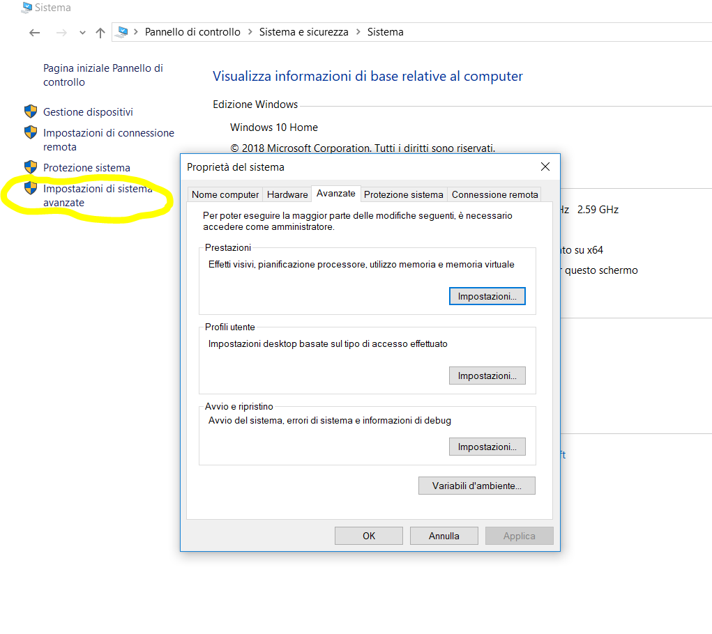

# Come compilare in Java

The steps in writing a Java program is illustrated as above:


**Step 1**: Write the source code "Xxx.java".

**Step 2**: Compile the source code "Xxx.java" into Java portable bytecode (or machine code) "Xxx.class" using the JDK's Java compiler by issuing the command `javac Xxx.java`.

**Step 3**: Run the compiled bytecode "Xxx.class", using the JDK's Java Runtime by issuing the command `java Xxx`.

## Settare la variabile `PATH`

Dal prompt dei comani deve essere possibile eseguire il programma `javac`, il compilatore java.

Quando installate il JDK (*Java Development Kit*) sul vostro PC, installate sia il compilatore `javac` (compila i file `.java` in `.class`) sia l'interprete `java` che esegue il bytecode (i file `.class`).

Ad esempio sul mio PC ho installato il JDK in:

`C:\dev\jdk-11.0.1`

sotto la directory 

`C:\dev\jdk-11.0.1\bin` ci sono i programmmi `javac` e `java`.

Come per qualsiasi altro programma per far si che si possano eseguire da qualsiasi directory che sia diversa dalla directory in cui è stato installato, è necessario configurare la variabile d'ambiente `PATH` con il percorso agli eseguibili, `javac` e `java`.

Nel nostro caso dovremo aggiungere al PATH il percorso `C:\dev\jdk-11.0.1\bin`.

Il fatto di dover settare la variabile d'ambiente `PATH` perchè un programma sia trovato vale sia per sistemi operativi Windows, Linux e Unix. Cambia solo la sintessi tra i vari sistemi su come settare la variabile d'ambiente.

Tornando al nostro caso su Windows, il primo modo è di creare uno script `.bat` che eseguite dal prompt dei comandi, contenete in questo caso:

`set PATH=%PATH%;C:\dev\jdk-11.0.1\bin`

In questo modo setto il `PATH` aggiungendo ai percorsi precedenti il nuovo percorso per trovare il JDK.

Per verifica potere dal prompt vedere il nuovo `PATH`:

Digitare da prompt: `echo %PATH%` per vedere il contenuto del `PATH`.

```
C:\Users\cam>echo %PATH%
C:\Program Files (x86)\Intel\iCLS Client\;C:\Program Files\Intel\iCLS Client\;C:\windows\system32;C:\windows;C:\windows\System32\Wbem;C:\windows\System32\WindowsPowerShell\v1.0\;C:\Program Files (x86)\NVIDIA Corporation\PhysX\Common;C:\Program Files\Microsoft SQL Server\130\Tools\Binn\;C:\WINDOWS\system32;C:\WINDOWS;C:\WINDOWS\System32\Wbem;C:\WINDOWS\System32\WindowsPowerShell\v1.0\;C:\dev\Git\cmd;C:\Program Files (x86)\Windows Kits\10\Windows Performance Toolkit\;D:\opt\GtkSharp\2.12\bin;D:\opt\Yarn\bin;C:\Program Files\dotnet\;C:\Program Files (x86)\Intel\Intel(R) Management Engine Components\DAL;C:\Program Files\Intel\Intel(R) Management Engine Components\DAL;C:\Program Files (x86)\Intel\Intel(R) Management Engine Components\IPT;C:\Program Files\Intel\Intel(R) Management Engine Components\IPT;C:\WINDOWS\System32\OpenSSH\;C:\dev\nodejs_8.12.0\;D:\dev\Ruby24-x64\bin;C:\dev\python27;C:\dev\openshift-origin-client-tools-v1.3.0-3;C:\Users\cam\AppData\Local\Microsoft\WindowsApps;C:\dev\Git\usr\bin;C:\dev\Heroku\bin;C:\dev\python27\Scripts;C:\Users\cam\AppData\Local\atom\bin;C:\Users\cam\AppData\Local\Yarn\bin;D:\opt\sqlite3;D:\opt\sqlite-tools-win32-x86-3190300;C:\Users\cam\AppData\Local\Microsoft\WindowsApps;D:\dev\apache-maven-3.5.3\bin;D:\dev\emacs-25.3_1\bin;D:\dev\gradle-4.7\bin;C:\Users\cam\.dotnet\tools;D:\dev\VSCode\bin;C:\Users\cam\AppData\Roaming\npm;C:\dev\jdk-11.0.1\bin;

C:\Users\cam>
```

Potere vedere che in coda è stato aggiunto il percorso `C:\dev\jdk-11.0.1\bin` come volevamo.

Ora potete eseguire `javac` e il comando viene trovato.

Ad esempio digitando da prompt:

```
C:\Users\cam>javac -version
javac 11.0.1

C:\Users\cam>
```

**N.B:** se aprite un altro prompt di comandi il `PATH` qui non è con il nuovo `PATH` che avete configurato: dovete eseguite anche qui lo script per aggiungere al  path il percorso a java.

Tutto ciò è molto scomodo.

Il metodo alternativo e in genere utilizzato del programmatore è quello di configurarlo tra le variabili d'ambiente di windows tramite il pannello di controllo:

`Pannello di controllo` -> `Sistema e sicurezza` -> `Sistema` -> `Impostazioni di sistema avanzate` 



Qui si apre un pannello *Proprietà di sistema* e cliccate sul tab 'Avanzate' e da qui su il bottone 'Variabili d'ambiente'.


Qui settate le variabili d'ambiente che vi interessano con *nuova* o *modifica*.

Nel sosto caso settiamo la variabile d'ambiente `PATH` che è quella che ci interessa.


