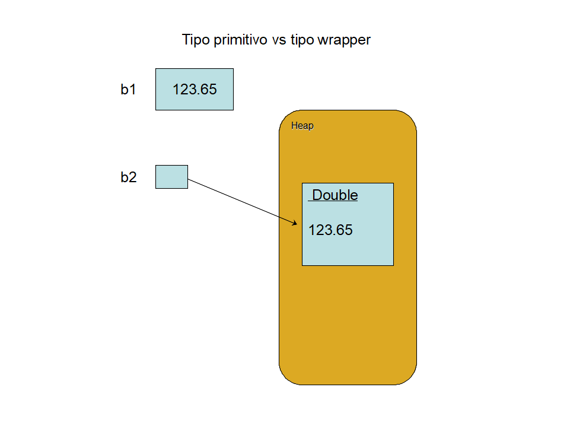
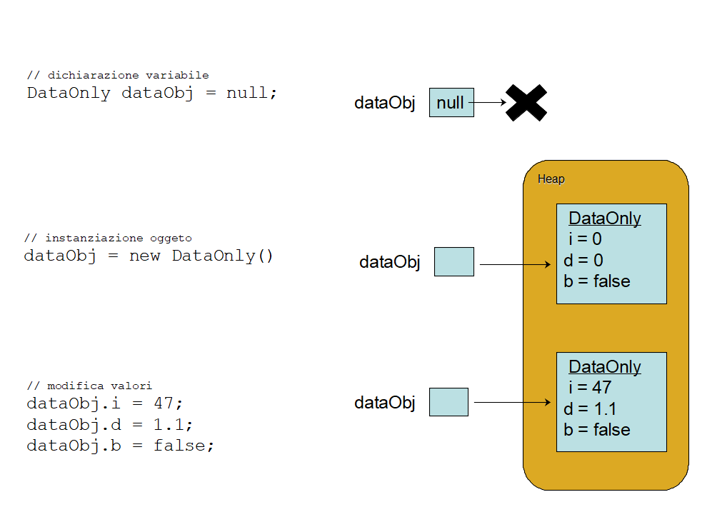
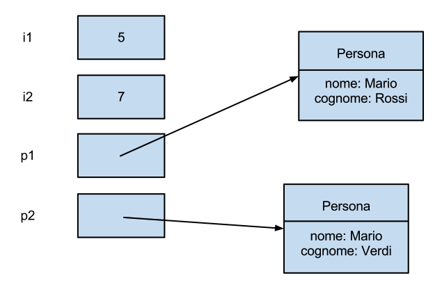
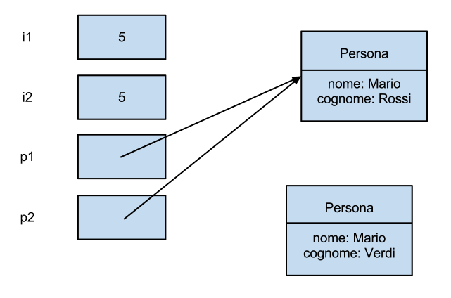

# CORSO INFORMATICA 5° MAINF

## MATERIALE

Specifiche Java https://docs.oracle.com/javase/specs/index.html

Java doc: https://docs.oracle.com/javase/7/docs/api/index.html?overview-summary.html

Libro: **Java in a Nutshell** - 6th edition

## ALCUNE SEMPLICI DEFINIZIONI

Java è un linguaggio di programmazione ad oggetti. I linguaggi di programmazione ad oggetti vengono ideati intorno alla fine degli anni 60, il primo linguaggio ad oggetti il *Simula-67* serviva per eseguire simulazioni, da qui il nome. Linguaggi comuni precedentemente erano quelli procedurali come *PASCAL* e *C*, in cui il programmatore definiva strutture dati e algoritmi (funzioni) che agivano su queste strutture dati. 

Con la programmazione ad oggetti, il programmatore crea oggetti che modellano il problema e ogni oggetto ha un proprio stato ed riponde a dei messaggi.

Facciamo un esempio: abbiamo un oggetto di tipo *lampadina*, che ha lo stato possibile *acceso* o *spento* e risponde ai messaggi (espone dei metodi) *accendi* e *spegni* che modificano lo stato dell'oggetto. Oggetti che hanno medesime caratteristiche appartengono alla stessa classe, ad esempio la classe *Lampadina* o la classe *Studente*. 

Due oggetti della stessa classe ad esempio *Lampadina* possono avere stato diverso: una magari è accesa e l'altra spenta, rispondono agli stessi messaggi, *accendi* e *spegni*, ma dare risultati diversi in base al loro stato di ogni oggetto.  

Ogni cosa in java è un oggetto (vedremo che ci sono anche delle eccezioni - i tipi primitivi). Come si creano gli oggetti in un programma? Dalle classi attraverso l'operazione di *new* che crea un oggetto dalla classe invocando il metodo construttore definito nella classe.

Quindi scrivendo il codice in java prima si definiscono le classi di oggetti necessari per descrivere il nostro problema e poi si creano, dalle classi, gli oggetti ognuno con un proprio stato.  

Nell'esempio delle lampadine definisco la classe **Lampadina** ed creo due oggetti **lampadina1** e **lampadina2**.

```
// pseudo codice 

// definizione classe Lampadina
class Lampadina {
	// attribito classe 
	boolean luceStatus; 
	Lampadina() {
		this.luceStatus = false;
	}
    
	Lampadina(luceStatus) {
		this.luceStatus = luceStatus;
	}
    
	// metodi
	void accendi() {
		this.luceStatus = true;
	}

	void spegni() {
		this.luceStatus = false;
	}
}  // fine definizione classe

// creo una lampadina già accesa
Lampadina lampadina1 = new Lampadina(true);
lampadina1.spegni(); // invoco il metodo di spegnimento

// seconda lampadina
Lampadina lampadina2 = new Lampadina(true);
lampadina2.accendi(); // invoco il metodo di accensione

```

## Tipi primitivi in JAVA

Come detto questi sono le uniche eccezioni al fatto che in java tutto è composto da oggetti.

|Type |Contains| Default| Size| Range|
|-----|--------|--------|-----|------|
| boolean |true or false| false| 1 bit | NA |
| char | Unicode character | \u0000 | 16 bits | \u0000 to \uFFFF |
| byte | Signed integer | 0 | 8 bits | -128 to 127 |
| short | Signed integer | 0 | 16 bits | -32768 to 32767 |
| int | Signed integer | 0 | 32 bits | -2147483648 to 2147483647 |
| long | Signed integer | 0 | 64 bits | -9223372036854775808 to 9223372036854775807 |
| float | IEEE 754 floating point | 0.0 | 32 bits | 1.4E-45 to 3.4028235E+380 |
| double | IEEE 754 floating point | 0.0 | 64 bits | 4.9E-324 to 1.7976931348623157E+308 |

La dimensione del tipo non cambia a seconda dell'architettura della macchina come avvine nella maggiorparte dei linguaggi, garantendo in questo modo maggiore partabilità del codice.

Importante sapere che per ogni tipo primitivo esiste il corrispettivo tipo wrapper, di tipo reference.

|Type |Wrapper type|
|-----|--------|
| boolean |Boolean|
| char | Character |
| byte | Byte |
| short | Short |
| int | Integer |
| long | Long |
| float | Float |
| double | Double |

Esempio utilizzo tipo prinitivo e wrapper:

```java
double b1 = 123.65;

Double b2 = new Double(123.65); //wrapper class
```
I tipi wrapper sono classi che incapulano i tipi primitivi: per instanziare la classe si utilizza la **new** che alloca la memoria per l'oggetto.



Utilizzzati all'interno di un metodo, i tipi primitivi vengono allocati nell'area di memoria dello stack e la variabile contiene il valore direttamente, i tipi corrispondenti di tipo reference, instanziati con l'operazione di **new**, sono allocati invece, nell'area di memoria dello heap.

```java
Double b2 = new Double(123.65); 

Double b3 = new Double(600.98); 

// metodo equals della classe Double
if(b2.equals(b3)){
	System.out.println("B2 e B3 sono equals");
} else {
	System.out.println("B2 e B3 sono NON equals"); 
}

// metodo doubleValue

// metodo che ritorna in tipo primitivo 'double'
double dB = b2.doubleValue(); // return 123.65

// metodo statico per convertire da stringa a tipo primitivo 'double'
double dB2 = Double.parseDouble("123.65");
```

La scelta di mantenere tipi primitivi, utilizzati nelle operazioni matemetiche, all'interno del linguaggio Java, è stata giustificata proprio per questioni di performance: allocazione di dati sullo stack è più veloce rispetto alla `new` che alloca nell'area di memoria dello `heap`, inoltre l'accesso al tipo primitivo è diretto, mentre quello all'oggetto wrapper è tramite reference.

I tipi wrapper servono per inserire i dati nelle java collection: tipi di dati astratti come *Liste*, *Stack*, *Map*, *Set* che servono per lavorare su collezioni di oggetti. Per analogia sulle collezioni, con quanto già visto in C# (Commonly Used Collection Types)[https://docs.microsoft.com/en-us/dotnet/standard/collections/commonly-used-collection-types].


Tipi collezioni in java (solo per far capire di cosa parliamo)


Gli [array](./Array.md) sono il primo tipo di collezioni che vediamo, sono la struttura dati più efficiente per mantenere dati sia primitivi che reference a oggetti omogenei ma hanno il limite che una volta creati hanno dimensione fissa. 

Per questo, per avere strutture dati che abbiano dimensione variabile in base alle esigenze sono state introdotte nel JDK le [java collections](./Collections.md), un insieme di classi con diverse caratteristiche per tenere gli oggetti che sono stati creati nel programma.

Esempio di creazione di un array vs un `java.util.ArrayList`, struttura dati che fa parte delle [java collections](./Collections.md):

```java
// array di 10 interi
int arr[] = new int[10];

// java.util.ArrayList
ArrayList<Integer> arrL = new ArrayList<Integer>();

ArrayList<Person> arrL = new ArrayList<Person>();

```

### Tipo booleano (boolean type)

```java
boolean isMonday = true;
boolean isChristmas = false;
```

The boolean type represents truth values. This type has only two possible values,
representing the two Boolean states: on or off, yes or no, true or false. Java reserves the words `true` and `false` to represent these two Boolean values.

### Tipo carattere (Char type)

```java
char c = 'A';
// nonprinting ASCII characters or escape certain punctuation 
char tab = '\t', nul = '\000', aleph = '\u05D0', slash = '\\';
```
| Escape sequence | Character value |
|-----------------|-----------------|
| \b | Backspace |
| \t | Horizontal tab |
| \n | Newline |
| \f | Form feed |
|\r | Carriage return |
| \" | Double quote |
| \' | Single quote |
| \\\ | Backslash |
|\ xxx | The Latin-1 character with the encoding xxx, where xxx is an octal (base 8) number between 000 and 377. The forms \ x and \ xx are also legal, as in \0, but are not recommended because they can cause difficulties in string constants where the escape sequence is followed by a regular digit. This form is generally discouraged in favor of the \uXXXX form.|
| \u xxxx | The Unicode character with encoding xxxx, where xxxx is four hexadecimal digits. Unicode escapes can appear anywhere in a Java program, not only in character and string literals. |

### Letterali di Stringhe

Non è uno dei tipi primitivi, infatti in java c'è la classe [String](https://docs.oracle.com/javase/7/docs/api/java/lang/String.html), ma siccome le stringhe somo molto utilizzate all'interno dei programmi, Java include una sintassi speciale per includere valori stringa nel codice sorgente.

```java
"Hello, world"
"'This' is a string!"
```

### Tipo intero

`byte`, `short`, `int` e `long`

E' possiblile esprimere il valore anche in notazione ottale ( `0` - zero davanti) ed esadecimale `0x` o `0X`.

```java
0xff // Decimal 255, expressed in hexadecimal
0377 // The same number, expressed in octal (base 8)
0b0010_1111 // Decimal 47, expressed in binary
```

Per il tipo `long` il valore si esprime mettendo il carattere `l` o `L` alla fine del numero.

```java
1234 // An int value
1234L // A long value
0xffL // Another long value
```

*N.B*: Dividere un intero per `0` o eseguire l'operazione modulo `0` genera l'errore a runtime [ArithmeticException](https://docs.oracle.com/javase/7/docs/api/java/lang/ArithmeticException.html).

Ogni tipo intero ha la corrispondente classe wrapper di tipo `Byte`, `Short`, `Integer` e `Long`.

Ognuna di queste classi definisce le costanti `MIN_VALUE` e `MAX_VALUE` che descrivono il range (intervallo) del tipo. 

Inoltre queste classi wrapper includono dei metodi statici come [Byte.parseByte](https://docs.oracle.com/javase/7/docs/api/java/lang/Byte.html#parseByte(java.lang.String)) o [Integer.parseInt](https://docs.oracle.com/javase/7/docs/api/java/lang/Integer.html#parseInt(java.lang.String)) per convertire da stringa a tipo primitivo. 

**ESERCIZIO**: 
Utilizzo di alcune classi standard della JDK per convertire stringhe di input nei numeri corrispondenti come interi.

|INPUT STRING | TIPO INPUT| RETURN VALUE INTERO |
|-------------|-------|-------------|
|"495"        | decimale | 495          |
|"0X1EF"      | esadecimale | 495          |
|"0757"       | ottale | 495          |

Verificare cosa succede se do in input la stringa "pippo" che non corrisponse a nessun
numero.

### Tipi decimali (Floating-point types)

I valori dei numeri decimali sono di default di tipo `double`, per esprimeri come tipo  `float` aggiungere la lettera `f`o `F` a fine numero.

```java
float f = 6.76f;
double d = 6.76;
```
I numeri decimali possono anche essere espressi in notazione scintifica, con esponente, in cui il numero è seguito dalla lettera e o E (per esponente) e un altro numero. Quest'altro numero rappresenta l'esponente base 10 per il quale il primo numero è moltiplicato:

```java
1.2345E02 // 1.2345 * 10^2 or 123.45
1e-6 // 1 * 10^-6 or 0.000001
6.02e23 // Avogadro's Number: 6.02 * 10^23
```

Float e double in notazione scientifica:

```java
double d = 6.02E23;
float f = 6.02e23f;
```

## Reference Types

Tutti i tipi di dati che **non** sono primitivi (`int`, `char`, `short`.... visti prima) sono di tipo reference: quando creo un oggetto da una classe con l'operazione di `new` creo una reference all'oggetto, un riferimento che mi permette di utilizzare l'oggetto, cioè modificare il suo stato. E' un tipo di dato che è un istanza di una classe, che sia tra quelle fornite dal JDK o che sia stata definita da un programmatore.

Finora abbiamo visto esempi di reference creati dalle classi wrapper dei tipi primitivi, classi già definite all'interno del JDK.

Definiamo una classe con alcuni semplici attributi.

```java
class DataOnly {
	int i;
	double d;
	boolean b;
}
```
questa classe non fa niente se non contenere dei dati. Se creiamo un oggeto da questa classe, `dataObj` è la reference:

```java
DataOnly dataObj = new DataOnly();
```

tramite la refernce data possiamo modificare l'oggetto (modificare il suo stato):

```java
objectReference.member
```
Per esempio:
```java
dataObj.i = 47;
dataObj.d = 1.1;
dataObj.b = false;
```
Vediamo passo passo gli statement eseguiti a livello di memoria.



**DOMANDA:**  
Ma la classe `DataOnly` è come una `struct` in C?

Si, ma quando creo l'oggetto in java con la `new`, l'oggetto reference è come un puntatore alla `struct`.  In java, tranne che per i tipi primitivi, lavoro sempre per reference.

Vedi [StructInC-JavaClass](https://github.com/5MAINF/StructInC-JavaClass) per raffrontro tra codice in c e corrispettivo in java.

**ESERCIZIO:** 
1. Scrivete il codice relativo all'esempio di sopra - Classe `DataOnly`, eseguite instanziazione di un oggetto della classe e modificate dello stato; Eseguite la print dello stato modificato; Fate l'override del metodo `toString()` ereditato da Object per fare una visualizzazione più utile rispetto alla visualizzazione di default.

Altri tipi di reference type, oltre alle classi, sono gli array e i tipi enumerativi.

### Assegnamento dei tipi reference 

Esempio:

```java
int i1 = 5;
int i2 = 7;
Persona p1 = new Persona("Mario", "Rossi");
Persona p2 = new Persona("Mario", "Verdi");
```


Fin qui sembra tutto semplice, andiamo avanti facendo un po’ di assegnazioni:

```java
i2 = i1;
p2 = p1;
```


Adesso p1 e p2 puntano allo stesso oggetto: abbiamo una condivisione di memoria che può risultare pericolosa se non gestita adeguatamente. Infatti richiamando un metodo setter su uno dei due oggetti (per esempio `p1.setNome("Fabio")`) si modificherà l’oggetto condiviso dai due puntatori. Non è sicuramente un dramma (e a volte può essere una cosa utile da sfruttare) ma è comunque una cosa da tenere presente.

**N.B:** Ora l'oggetto *Persona* con nome *'Mario'* e cognome *'Verdi'* non avendo più nessuna reference da cui è puntato, può essere eliminato dal thread, sempre attivo nella JVM, del **garbage collector**.

Il **garbage collector**, letteralmente collettore della spazzatura, si occupa di liberare la memoria dello heap degli oggetti non più referenziati all'interno del processo.  

### Valori di default dei tipi primitivi

Quando un tipo primitivo è membro di una classe, se non inizializzato prende i seguenti valori:

| Primitive type | Default |
|----------------|---------|
| boolean        | false   |
| char           | ‘\u0000’ (null) |
| byte | (byte)0 |
| short | (short)0 |
| int   | 0 |
| long  |0L |
| float | 0.0f |
| double | 0.0d |

Questo non è garantito invece per le *variabili locali* che prendono un valore arbitrario (come in C e C++), è compito del programmatore inizializzarle prima dell'utilizzo altrimenti il compilatore dà errore di compilazione.

Es:

```java
int v;

// v non è stato ancora inizializzato --> errore di compilazione
myObject.print(v);

```

Altri tipi di reference type, oltre alle classi, sono gli array e i tipi enumerativi.

### Metodi, argomenti e valori di ritorno.

I metodi in java determinano il messaggio che un oggetto può ricevere.

```java
ReturnType methodName( /* Argument list */ ) {
/* Method body */
}
```
Esempio di chiamata di un metodo:
```java
objectName.methodName(arg1, arg2, arg3);
```
Esempio con parametro di ritorno:
```java
int x = a.f();
```
Il tipo del ritorno deve essere compatibile con il tipo di **x**. La chiamata di un metodo è spesso detto *inviare un messaggio all'oggetto*. Nell'esempio precedente, il messaggio è **f()** e l'oggetto è **a**. La programmazione ad oggetti è spesso sintetizzata con il concetto di 'spedire un messaggio a un oggetto'. 

### Attributi e metodo statici di una classe

```java
class StaticTest {
	static int i = 47;
}
```
Anche quando creiamo due oggetti distinti abbiamo una sola zona di memoria per
`StaticTest.i`: i due oggetti condividono la stessa `i`. Esempio:

```java
StaticTest st1 = new StaticTest();
StaticTest st2 = new StaticTest();
```

A questo punto entrambi gli oggetti `st1.i` e `st2.i` condividono la stessa zona di memoria contenete il valore **47**.

```java
StaticTest.i++;
```
A questo punto `st1.i` e `st2.i` valgono **48**.

L'utilizzo del nome della classe è il modo preferito per riferirsi alle variabili **static**.

Logica simile è utilizzata per i metodi **static**. La sintassi è `ClassName.method( )`. Esempio:

```java
class Incrementable {
	static void increment() { StaticTest.i++; }
}
```
```java
Incrementable sf = new Incrementable();
sf.increment();
```

O lo puoi invocare, direttamente dalla classe, così:

```java
Incrementable.increment();
```
Sebbene **static** quando applicato agli attributi di una classe, cambia il modo in cui il dato è creato (uno per ogni classe rispetto a uno per ogno oggetto per le classi non-**static**), quando applicato ai metodi, il cambiamanto non è così drammatico. Un uso dei metodi **static** è quello di invocare un metodo senza creare l'oggetto. 

## Costruzione di un programma

Vedi progetto [IntroduzioneJava](https://github.com/5MAINF/IntroduzioneJava) per esempi di semplici classi, script di compilazione ed esecuzione.

Su **package**, **import** e **CLASSPATH**, vedi: http://www.ntu.edu.sg/home/ehchua/programming/java/j9c_packageclasspath.html

### Visibilità dei nomi

Organizzare il sorgente in **package**.

La struttura di directory e sottodirectory deve rispettare il nome del package.

Se abbiamo la seguente classe:

```java

package it.isisgallarate.base;

public class TestSimpleClass {
	
	public static void main(String args[]) {
		
		DataOnly dataObj = new DataOnly();
		
		dataObj.i = 47;
		dataObj.d = 1.1;
		dataObj.b = false;
		
	}
}

class DataOnly {
	int i;
	double d;
	boolean b;
}

```

il codice sarà in un file nella directory `it/isisgallarate/base/TestSimpleClass.java`

Se per ordine nel progetto mettiamo il codice sorgente nella directory `src`, per compilare:

`javac -d target src\it\isisgallarate\base\TestSimpleClass.java`

Il codice compilato .class viene creato nella directory target perchè abbiamo specificato l'opzione *-d*.

Per eseguire:

`java -classpath target it.isisgallarate.base.TestSimpleClass`

**DA NOTARE** senza specidicare l'opzione **-classpath**, non trova la classe: 

```

PS D:\PROGETTI\workspace\IntroduzioneJava> .\build_siple_class.bat

D:\PROGETTI\workspace\IntroduzioneJava>javac -d target src\it\isisgallarate\base\TestSimpleClass.java
PS D:\PROGETTI\workspace\IntroduzioneJava>
PS D:\PROGETTI\workspace\IntroduzioneJava>
PS D:\PROGETTI\workspace\IntroduzioneJava> cd .\target\
PS D:\PROGETTI\workspace\IntroduzioneJava\target>
PS D:\PROGETTI\workspace\IntroduzioneJava\target>
PS D:\PROGETTI\workspace\IntroduzioneJava\target> java it.isisgallarate.base.TestSimpleClass
PS D:\PROGETTI\workspace\IntroduzioneJava\target>
PS D:\PROGETTI\workspace\IntroduzioneJava\target> cd ..
PS D:\PROGETTI\workspace\IntroduzioneJava>
PS D:\PROGETTI\workspace\IntroduzioneJava>
PS D:\PROGETTI\workspace\IntroduzioneJava>
PS D:\PROGETTI\workspace\IntroduzioneJava> java it.isisgallarate.base.TestSimpleClass
Error: Could not find or load main class it.isisgallarate.base.TestSimpleClass
Caused by: java.lang.ClassNotFoundException: it.isisgallarate.base.TestSimpleClass
PS D:\PROGETTI\workspace\IntroduzioneJava>
PS D:\PROGETTI\workspace\IntroduzioneJava>
```

### Utilizzo di altri componenti

Per importare la definizione di una classe utilizzare **import**. 

`import java.util.ArrayList;`

oppure 

`import java.util.*; // tutte le classi sotto il pachetto java.util`

Per le classi del JDK questo basta, siamo sicuri che il nostro codice potrù essere compilato (**javac**) ed eseguito (**java**).

Se utilizziamo librerie esterne al JDK queste devono essere visibili: l'opzione `-classpath` al comando javac e java permette di specificare il path di queste librerie.

## Costruzione del primo programma

```java

// HelloDate.java
import java.util.*;
public class HelloDate {
		public static void main(String[] args) {
				System.out.println("Hello, it’s: ");
				System.out.println(new Date());
		}
}
```

### Ugualianza per riferimento vs. Ugualianza per valore

Se utilizzo l'operatore `==` verifico l'**ugualianza per riferimento**.

La classe `Object` classe padre di tutte le classi ho il metodo `boolean equals(Object obj)` che può essere utilizzato, se reimplementato nelle nostre classi, per eseguire l'**ugualianza per valore**. Di default anche il metodo `equals` di `Object` esegue ugualianza per riferimento.

Vediamo esempio:

```java
package it.isisgallarate.test;

public class TestEqualsOnObjects {
	
	public static void main(String[] args) {
		
		Object o1 = new Object();
		Object o2 = new Object();
		
		if (o1 == o2) {
			System.out.println("SONO UGUALI PER REFERENCE - o1, o2");
		} else {
			System.out.println("SONO DIVERSI PER REFERENCE - o1, o2"); // PRINT THIS
		}
		
		if (o1.equals(o2)) {
			System.out.println("EQUALS TRUE - o1, o2");
		} else {
			System.out.println("EQUALS FALSE - o1, o2"); // PRINT THIS
		}
		
		// Oggetto o1 assegnato a o3
		
		Object o3 = o1;
		
		if (o1 == o3) {
			System.out.println("SONO UGUALI PER REFERENCE - o1, o3"); // PRINT THIS
		} else {
			System.out.println("SONO DIVERSI PER REFERENCE - o1, o3");
		}
		
		if (o1.equals(o3)) {
			System.out.println("EQUALS TRUE - o1, o3"); // PRINT THIS
		} else {
			System.out.println("EQUALS FALSE - o1, o3"); 
		}
				
	}
}

```

Qualsiasi classe da noi creata, in quanto implicitamente sottoclasse di `Object` erediterebbe lo stasso comportamento del metodo `equals`. E' quindi necessario per ottenere un confronto tra valori, reimplementere `equals` per restituire `true`, quando i valori sono uguali.

Esempio:

```java
package it.isisgallarate.equals;

public class Vino {
	
	private String nome;
	private int anno;
	private int prezzo;
		
	public Vino(String nome, int anno, int prezzo) {
		this.nome = nome;
		this.anno = anno;
		this.prezzo = prezzo;
	}
	
	public String getNome() {
		return nome;
	}

	public void setNome(String nome) {
		this.nome = nome;
	}

	public int getAnno() {
		return anno;
	}

	public void setAnno(int anno) {
		this.anno = anno;
	}
	
	public int getPrezzo() {
		return prezzo;
	}


	public void setPrezzo(int prezzo) {
		this.prezzo = prezzo;
	}


	@Override
	public int hashCode() {
		final int prime = 31;
		int result = 1;
		result = prime * result + anno;
		result = prime * result + ((nome == null) ? 0 : nome.hashCode());
		return result;
	}
	
	@Override
	public boolean equals(Object obj) {
		if (this == obj)
			return true;
		if (obj == null)
			return false;
		if (getClass() != obj.getClass())
			return false;
		Vino other = (Vino) obj;
		if (anno != other.anno)
			return false;
		if (nome == null) {
			if (other.nome != null)
				return false;
		} else if (!nome.equals(other.nome))
			return false;
		return true;
	}

	@Override
	public String toString() {
		return "Vino [nome=" + nome + ", prezzo=" + prezzo + "]";
	}
		
}

```

Vedi anche: https://codingjam.it/tutorial-java-il-metodo-equals-e-loperatore/ per ulteriore spiegazione.

**ESERCIZIO:**

* Verificate che il metodo `equals` è stato reimplementato nelle classi `String` e dei tipi wrapper dei tipi primitivi (`Integer`, `Float`, `Double`...), costruendo dei programmi di esempio. Compilateli ed eseguiteli (fate dei semplici file .bat per eseguire le due operazioni).

* Definite due classi con diverso nome ma praticamente uguali come attributi, l'unica differenza è che in una il metodo `equals` è reimplementato. Implementate quindi in una classe il metodo `equals` per fare il confronto sui valori, mentre nell'altra vi basate sull'implementazione ereditata dalla classe `Object`. Fate vedere il diverso comportamento di oggetti creati da queste due classi.

* Abbiamo visto l'assegnamento di tipi primitivi e di oggetti (esempio di oggetti di tipo *Persona*). Fate un esempio dell'utilizzo del metodo `clone` per far vedere la differenza con l'assegnamento. Scrivete del codice che esegue la clone di un oggetto (esempio un oggetto di tipo Persona o definite uan vostra classe). Modificate gli attributi e fere vedere le differenze rispetto all'assegnamento. 

* Anche gli array in java sono di tipo reference anche se non c'è una classe Array ma si esegue l'operazione di *new*. Creare un array contenente oggetti di tipo `Persona`. Assegnare a una reference di tipo array di `Persona`. A una terza reference di array di `Persona` assegnare la `clone` dell'array. Descrivere con un disegno lo stato della memoria. Fare un programma che modifica il contenuto degli array e degli oggetti `Persona` e vedere le differeze nel caso di array assegnato e di array ottentuto con l'operazione di `clone`.

* Dato l'esempio con classi `Enoteca` e `CassaDiVini`, all'inizio avere utilizzato la struttura array per contenere l'elenco delle casse; fare la prova a utilizzare invece la classe `java.util.Vector`. 

* Utilizzare i metodi `contains` e `indexOf` della classe `java.util.Vector` per cercare se c'è una certo tipo di cassa di vini.


